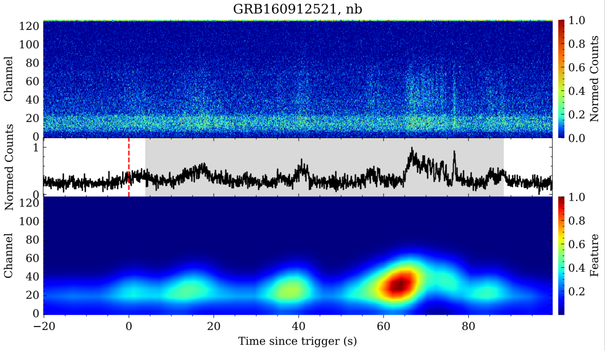
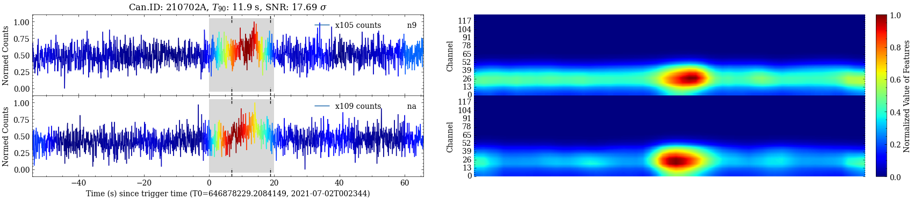

# binary_distinguish_GRB_by_DL
Paper information：  [IOP](https://iopscience.iop.org/article/10.3847/1538-4365/ad2de5)
```
Zhang P, Li B, Gui R, et al. Application of Deep-learning Methods for Distinguishing Gamma-Ray Bursts from Fermi/GBM Time-tagged Event Data[J]. The Astrophysical Journal Supplement Series, 2024, 272(1): 4.
```

The deep learning algorithms  is applied to 
distinguish gamma-ray bursts.   
This directory contains dataset, deep learning algorithms, and candidates.   
The samples in the dataset are count map consisting of light curves for each energy band, which extracted from the observation data of [Fermi/GBM](https://gammaray.nsstc.nasa.gov/gbm/).  
The deep learning algorithms is convolutional neural network. 
The candidates are the possible GRBs found from one year observations (20210701-20220701) of Fermi/GBM by applying the optimal model. 


Top: count map  
Middle: light curve of all energy band  
Bottom: heat map of features  

## requirements

numpy==1.15.4  
kears==2.14   
tensorflow==1.12.0  
keras_contrib

```
how to install keras_contrib:  
--------------- 
git clone https://www.github.com/keras-team/keras-contrib.git  
cd keras-contrib  
python setup.py install  
---------------
or use keras source code (keras_contrib directory) directly

```

## Datasets

download link:

## Trained model

download link of all models:  
best model (ResNet-CBAM@64ms): [h5 file](./trained_model/resnet-CBAM_64ms.h5)

## Candidates

candidate list: [csv](./candidates/candidate_list_20221221.csv)  
image of candidate list: [rar](./candidates/img_of_candidate_list_20221221.rar)  
example:  

Left:  mapping-curves of feature    
Right: heat map of features

## train model

how to train model

see jupyter-notebook: [ipynb](./code/train_model.ipynb)

## Test model

how to test the already trained model

see jupyter-notebook: [ipynb](./code/test_model.ipynb)

## Citation

If you use any part of this code, please cite our paper:  

Peng Zhang, Bing Li, RenZhou Gui, et al. 2023. Application of Deep Learning Methods for Distinguishing 
Gamma-Ray Bursts from Fermi/GBM TTE Data. Submitted to journal (The Astrophysical Journal Supplement Series).


